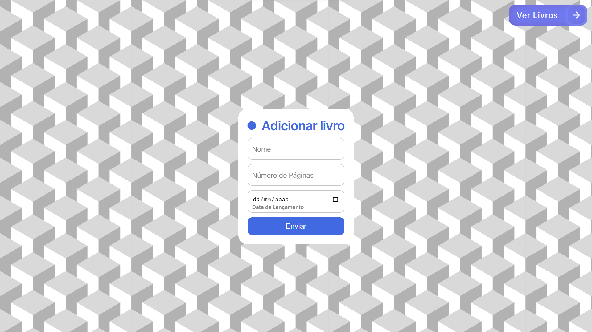
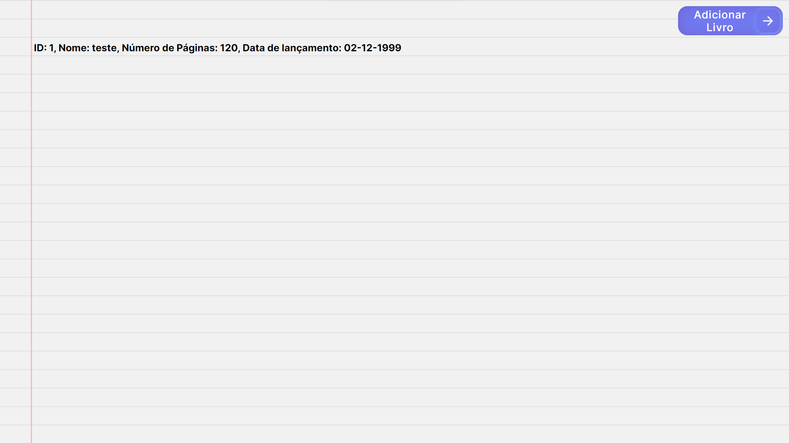

# Auto Estudo Ponderado: Conexão com Banco de dados RDS

## Nome do Projeto: Biblioteca-AE

### Explicação
&nbsp;&nbsp;&nbsp;&nbsp;Esse projeto de Auto Estudo foi criado usando NextJS juntamente com a lib pg para que assim fosse possível realizar interações entre o FrontEnd e o Banco de Dados postgres criado usando o amazon RDS.
&nbsp;&nbsp;&nbsp;&nbsp;As interações do projeto são a possibilidade de adicionar dados na tabela livros e poder ler esses dados criados.

### Telas:

#### Home:
&nbsp;&nbsp;&nbsp;&nbsp;Nessa tela existe um formulário que permite a adição de livros no banco de dados e um botão para ir até a tela de de listagem dos livros registrados

    

#### Livros:
&nbsp;&nbsp;&nbsp;&nbsp;Nessa tela é possível ver os livros cadastrados e existe um botão para voltar até tela Home

    

### Link do vídeo do projeto exclusivo pro Inteli:

https://drive.google.com/file/d/1YoZ4rdXddlgCzqzjEDw_GW6RhC820XPC/view?usp=sharing

